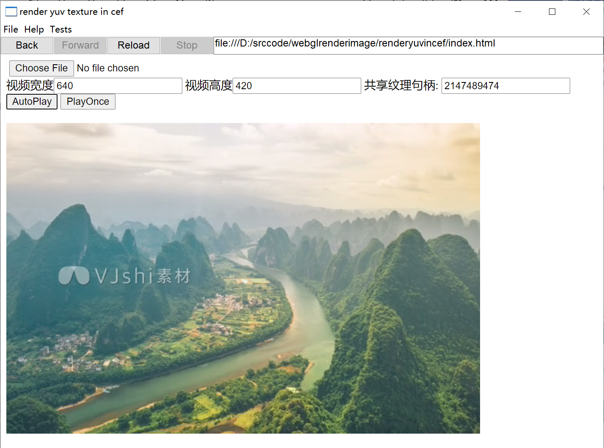
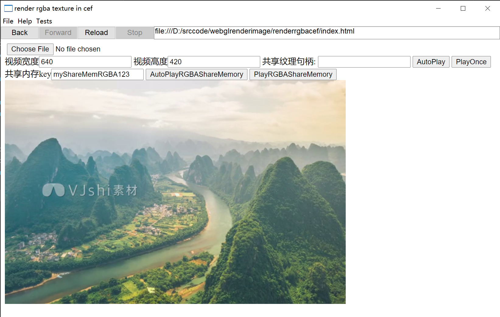

- [cefpatches](#cefpatches)
- [cef97源码版本信息](#cef97源码版本信息)
- [0001\_dx11sharetexture给cef97添加dx11纹理支持](#0001_dx11sharetexture给cef97添加dx11纹理支持)
  - [How to Run](#how-to-run)
  - [1. 添加javascript接口texBindSharedHandle](#1-添加javascript接口texbindsharedhandle)
    - [webgl\_rendering\_context\_base.idl](#webgl_rendering_context_baseidl)
    - [webgl\_rendering\_context\_base.h](#webgl_rendering_context_baseh)
    - [webgl\_rendering\_context\_base.cc](#webgl_rendering_context_basecc)
  - [2. 添加gpu command处理](#2-添加gpu-command处理)
  - [GPU Command Buffer原理](#gpu-command-buffer原理)
    - [客户端代码（在render进程）](#客户端代码在render进程)
    - [服务端代码（在gpu进程）](#服务端代码在gpu进程)
  - [添加TextBindShareHandle](#添加textbindsharehandle)
    - [gles2\_interface.h](#gles2_interfaceh)
    - [gles2\_cmd\_format.h](#gles2_cmd_formath)
    - [gles2\_cmd\_ids.h](#gles2_cmd_idsh)
    - [gles2\_implementation.h](#gles2_implementationh)
    - [gles2\_implementation.cc](#gles2_implementationcc)
    - [gles2\_cmd\_helper.h](#gles2_cmd_helperh)
    - [gles2\_cmd\_helper.cc](#gles2_cmd_helpercc)
    - [gles2\_cmd\_decoder.cc](#gles2_cmd_decodercc)
      - [1 添加函数定义声明](#1-添加函数定义声明)
      - [2 命令信息数组长度加1](#2-命令信息数组长度加1)
      - [3 把新加命令加入到命令信息数据](#3-把新加命令加入到命令信息数据)
      - [4 修改命令索引获取](#4-修改命令索引获取)
      - [5 添加命令处理函数](#5-添加命令处理函数)
  - [3. angle添加接口实现\_复制共享纹理](#3-angle添加接口实现_复制共享纹理)
    - [libGLESv2\_autogen.def](#libglesv2_autogendef)
    - [libGLESv2.gni](#libglesv2gni)
    - [DisplayD3D.h](#displayd3dh)
    - [新添加导出函数](#新添加导出函数)
- [0002\_sharememrender给cef97添加共享内存渲染。](#0002_sharememrender给cef97添加共享内存渲染)
  - [How to Run](#how-to-run-1)
  - [添加web接口](#添加web接口)
    - [canvas\_rendering\_context\_2d.idl](#canvas_rendering_context_2didl)
    - [offscreen\_canvas\_rendering\_context\_2d.idl](#offscreen_canvas_rendering_context_2didl)
    - [base\_rendering\_context\_2d.h](#base_rendering_context_2dh)
    - [base\_rendering\_context\_2d.cc](#base_rendering_context_2dcc)
    - [BUILD.gn](#buildgn)
  - [添加辅助类文件](#添加辅助类文件)
- [0003\_dxVersion给cef97添加dx版本判断。](#0003_dxversion给cef97添加dx版本判断)
  - [添加web 接口](#添加web-接口)
    - [webgl\_rendering\_context\_base.idl](#webgl_rendering_context_baseidl-1)
  - [添加gpu command buffer处理](#添加gpu-command-buffer处理)
    - [gles2\_interface.h](#gles2_interfaceh-1)
    - [gles2\_cmd\_ids.h](#gles2_cmd_idsh-1)
    - [gles2\_cmd\_format.h](#gles2_cmd_formath-1)
    - [gles2\_implementation.h](#gles2_implementationh-1)
    - [gles2\_implementation.cc](#gles2_implementationcc-1)
    - [gles2\_trace\_implementation.h](#gles2_trace_implementationh)
    - [gles2\_trace\_implementation.cc](#gles2_trace_implementationcc)
    - [gles2\_cmd\_decoder.cc](#gles2_cmd_decodercc-1)
    - [gles2\_cmd\_decoder\_passthrough.cc](#gles2_cmd_decoder_passthroughcc)
    - [gles2\_cmd\_decoder\_passthrough.h](#gles2_cmd_decoder_passthroughh)
    - [gles2\_cmd\_decoder\_passthrough\_doers.cc](#gles2_cmd_decoder_passthrough_doerscc)
  - [3. angle添加接口实现\_获取angle内部使用的DX版本。](#3-angle添加接口实现_获取angle内部使用的dx版本)
  - [编译](#编译)
  - [各部分修改取patch](#各部分修改取patch)
    - [src\_gpu\_command\_buffer.patch](#src_gpu_command_bufferpatch)
    - [src\_third\_party\_blink\_renderer\_modules\_webgl.patch](#src_third_party_blink_renderer_modules_webglpatch)
    - [src\_third\_party\_angle.patch](#src_third_party_anglepatch)
  - [web中javascript代码判断执行](#web中javascript代码判断执行)
- [0004\_SetWindowFps设置页面最高刷新帧率](#0004_setwindowfps设置页面最高刷新帧率)
  - [涉及的文件](#涉及的文件)
  - [添加web接口](#添加web接口-1)
  - [command buffer部分逻辑处理](#command-buffer部分逻辑处理)
  - [viz实际执行页面最高频道限制。](#viz实际执行页面最高频道限制)
  - [javascript验证](#javascript验证)
  - [参考](#参考)


# cefpatches

# cef97源码版本信息
各部分代码的版本信息
- depot_tools版本
```
Revision: f7b8f8f3cd77ecbd16c932525f1328110b9a4ca5
Author: Vadim Shtayura <vadimsh@chromium.org>
Date: 2021/11/16 3:10:05
Message:
Fix bytes vs str error in DownloadGerritHook.

It fails with: `write() argument must be str, not bytes`.

R=sokcevic@google.com

Change-Id: If6787140ea863ce3761a5c3747eb0b857b22fa47
Reviewed-on: https://chromium-review.googlesource.com/c/chromium/tools/depot_tools/+/3276505
Reviewed-by: Josip Sokcevic <sokcevic@google.com>
Commit-Queue: Vadim Shtayura <vadimsh@chromium.org>
----
Modified: git_cl.py

```
- chromium版本97.0.4692.20
```
Revision: d60c10f0af397f6366c958dddb075d630e07c5d3
Author: Chrome Release Bot (LUCI) <chrome-official-brancher@chops-service-accounts.iam.gserviceaccount.com>
Date: 2021/11/16 9:31:53
Message:
Publish DEPS for 97.0.4692.20

----
Modified: DEPS

```
- cef版本4692
```
Revision: 444ce60075405dd75e82b39de7143e6b2d1e41e3
Author: Nicolas Dusart <dusartnicolas@gmail.com>
Date: 2021/11/24 6:14:59
Message:
Fix CefURLRequest crash with failing HEAD requests (fixes issue #3226)

----
Modified: libcef/browser/net_service/browser_urlrequest_impl.cc

```
# 0001_dx11sharetexture给cef97添加dx11纹理支持
原理参考:

cef开发文档，参考[https://www.chromium.org/developers/](https://www.chromium.org/developers/)

添加纹理支持的步骤 :

1. 添加javascript接口text
    - 原理参考[https://www.chromium.org/developers/web-idl-interfaces/](https://www.chromium.org/developers/web-idl-interfaces/)
    - 
2. 添加gpu command处理
    - 原理参考[https://www.chromium.org/developers/design-documents/gpu-command-buffer/](https://www.chromium.org/developers/design-documents/gpu-command-buffer/)
    - 例子参考[https://codereview.chromium.org/8772033/](https://codereview.chromium.org/8772033/)
3. angle添加接口实现


本次实现的功能描述：
能实现在web上播放自己生产的视频，可以支持多路视频。
实现：
将需要渲染的视频帧写到共享纹理，在Canvas对应的Webgl中绑定共享纹理，读取共享纹理进行渲染，添加web接口，给到页面绑定共享纹理。
## How to Run
demo 运行依赖
- yuv420共享纹理写端
  - 请查看本git的这个项目[ShareTextureYUVFFmpeg](https://github.com/iherewaitfor/direct3d11demo/tree/main/ShareTextureYUVFFmpeg)
  - 先编译运行该项目，用于写共享纹理，以便cef有共享纹理可读。
- 编译好的cef及cefclient.
  - 将这些patch打到cef后，编译好。
  - 并使用一个应用打开页面，测试上可以直接使用cefclient项目。
  - 这里有一个编译好的Debug_x86版本[https://kdocs.cn/l/chI1rcTDB8Cm](https://kdocs.cn/l/chI1rcTDB8Cm)，下载解压后，运行cefclient.exe即可。
- 渲染页面
  - 请查看本git的这个项目[renderyuvincef](https://github.com/iherewaitfor/webglrenderimage/tree/main/renderyuvincef)
  - clone下载来后，在cefclient.exe中打开。

具体运行步骤：

- 先运行ShareTextureYUVFFmpeg的生成纹理程序
  - 为了更直观的查看效果，可先准备一个mp4文件，查看到其视频宽度和高度，如640x420
  - 本项目有自带一个yuv的图片，也可直接运行程序，不带参数，不过渲染的是一个静态的图片。
  - 运行后，可在标题栏查看生成的共享纹理句柄。后续会用到。如图中的2147489474

```
D:\srccode\direct3d11demo\ShareTextureYUVFFmpeg\CreateShareTexture\build\Debug>Demo.exe D:/guilinvideo.mp4
```


- 打开cefclient在地址址输入renderyuvincef的index.html地址
  - 在页面中输入视频宽高，如宽640，高420
  - 输入共享纹理句柄 ，如图中的2147489474
  - 点击AutoPlay，即可看到在页面渲染的视频。

```
D:/srccode/webglrenderimage/renderyuvincef/index.html
```



验证RGBA格式的流程类似。只需要替把依赖项目换成以下：

- 生成RGBA纹理项目
  - [ShareTextureRGBAFFmpeg](https://github.com/iherewaitfor/direct3d11demo/tree/main/ShareTextureRGBAFFmpeg)
  - 用法和yuv的一样，只是产生的纹理 是RGBA格式的。
- web渲染RGBA纹理 
  - [renderrgbacef](https://github.com/iherewaitfor/webglrenderimage/tree/main/renderrgbacef)
  - 用法和yuv的一样，只是其渲染的渲染的共享纹理是RGBA格式的。

## 1. 添加javascript接口texBindSharedHandle
公开为Javascript对象的Web接口，通常是由Web IDL(Interface Definition Language接口定义语言)指定。Web IDL是陈述性语言（有时不够空间，也写为WebIDL）。这是用在标准规范中的语言。Blink用IDL 文件来指定接口，并生成JavaScipt绑定（具体形式上，是V8 JavaScript虚拟机用来调用Blink本身的C++代码）。Blink中的Web IDL 接近标准，生成的绑定使用标准约定来调用Blink代码，但还有其他功能可以指定实现细节，主要是Blink IDL扩展属性。
在Blink中实现一个新的WebIDL接口：
- 接口：写一个IDL file: fool.idl
- 实现：写一个C++文件和头文件：foo.cc，foo.h
- 构建：加入将要构建的文件：编辑idl_in_core.gni/idl_in_modules.gni 和 generated_in_core.gni/generated_in_modules.gni
- 测试：在[web_tests](https://source.chromium.org/chromium/chromium/src/+/HEAD:third_party/blink/web_tests/)写单元测试(web tests)

这只我们只在现有接口Weg_render_context上新加一个方法，所以只需要修改对应的文件即可，不需要新增文件。涉及到需要修改的文件为
- src/third_party/blink/renderer/modules/webgl/webgl_rendering_context_base.idl
- src/third_party/blink/renderer/modules/webgl/webgl_rendering_context_base.h
- src/third_party/blink/renderer/modules/webgl/webgl_rendering_context_base.cc
### webgl_rendering_context_base.idl
在该文件上添加web接口规范。该文件主要用于生成对应的Javascript绑定。
```C++
[CallWith=ExecutionContext, RaisesException] void texBindSharedHandle(GLintptr handle);
```
### webgl_rendering_context_base.h
在该文件添加方法texBindSharedHandle声明
```c++
void texBindSharedHandle(ExecutionContext*, int64_t handle, ExceptionState&);
```
### webgl_rendering_context_base.cc
在该文件添加方法texBindSharedHandle定义
```C++
void WebGLRenderingContextBase::texBindSharedHandle(ExecutionContext*,
                                                    int64_t handle,
                                                    ExceptionState&) {
  if (isContextLost())
    return;
  ContextGL()->TexBindSharedHandle((GLintptr)handle);
}
```
在该方法实现中，调用 了GLES2Interface接口的TextBindShareHandle方法。在后续步骤描述怎么在GLES2Interface中添加方法。
## 2. 添加gpu command处理
Gpu Command生成和处理，主要是在render进程中根据业务需要生成GPU命令，然后命令传到GPU进程中，在GPU进程进行具体的GPU操作。本功能中，是要将业务传的共享纹理句柄传入，以便在gpu进程中，能读取该共享纹理的数据进程渲染。

GPU Command的原理参考[https://www.chromium.org/developers/design-documents/gpu-command-buffer/](https://www.chromium.org/developers/design-documents/gpu-command-buffer/).

## GPU Command Buffer原理
GPU Command Buffer实现原理：
其基本实现是一个叫"command buffer"( 命令缓冲)。客户端（render进程、pepper plugin等）写命令到一些共享内存。其更新一个'put'指针，通过IPC告诉GPU进程 它已经写到缓冲区的多远的位置了。GPU进程 或者是服务会从buffer（缓冲区）中读取这些命令。对于每个命令，它都会验证命令、参数以及参数是否适合操作系统图形API的当前状态 ，然后才对操作系统进行实际调用。This means even a compromised renderer running native code, writing its own commands, can hopefully not get the GPU process to call the graphics system in such a way as to compromise the system.
在编写新的服务端代码时，请记住这一点。永远不要设计一个要求客户端表现良好的新命令。要假定客户端可以变得无赖。例如，确保无论客户做什么，服务的记账都不会出错。

API层的实现：

简要说：
gl2.h->gles2_c_lib.cc->GLES2Implemetation->GLES2CmdHelper...SharedMemory...->GLES2DecoderImpl->ui/gfx/gl/gl_bindings->OpenGL

有一个接口CommandBuffer，负责协调GLES2CmdHelpe和GLES2DecoderImpl之间的通信。它有创建和删除共享内存的方法，以及来回通信当前状态的方法。特别是通过AsyncFlush()或Flush()从客户端发送最新的'put'指针，并通过'Flush'的结果获取最新的"get"指针。

一个名为CommandBufferService的CommandBuffer实现直接与GLES2DecoderImpl对话。如果你有一个单线程单进程的chrome，你可以将CommandBufferService的一个实例传递给GLES2CmdHelper，该想法是一切都会正常运行。在真正的多进程chrome中，还有另一种实现，CommandBufferProx，它使用IPC通过GpuCommandBufferStub到GpuSchedler再到CommandBufferService从客户端到服务进程通信。

### 客户端代码（在render进程）
注意： 在src/gpu/command_buffer/client and src/gpu/command_buffer/common 中的所有代码都必须不依赖任何额外的库进行编译，因为他们是被用在不信任的 Pepper plugin中的。
以khronos为例（注意本dx11共享纹理patch项目实现用的是angle）

- 定义public OpenGL ES 2.0接口

src/third_party/khronos/GLES2/gl2.h

src/third_party/khronos/GLES2/gl2ext.h

- 以下定义C接口。大多数是自动生成的

src/gpu/command_buffer/client/gles2_c_lib.cc

src/gpu/command_buffer/client/gles2_c_lib_autogen.h

- 以下是命令到command buffer的实现客户端侧的实现。大部分是自动生成的。

src/gpu/command_buffer/client/gles2_implementation.cc

src/gpu/command_buffer/client/gles2_implementation_autogen.h

- 这是一个主要是自动生成的类，用于帮助格式化命令。

src/gpu/command_buffer/client/gles2_cmd_helper.h

src/gpu/command_buffer/client/gles2_cmd_helper_autogen.h

- 这些定义了命令的实际格式

src/gpu/command_buffer/common/cmd_buffer_common.h

src/gpu/command_buffer/common/gles2_cmd_format.h

src/gpu/command_buffer/common/gles2_cmd_format_autogen.h

### 服务端代码（在gpu进程）
- 这是读取命令、验证和调用OpenGL的代码。

src/gpu/command_buffer/service/gles2_cmd_decoder.cc

src/gpu/command_buffer/service/gles2_cmd_decoder_autogen.cc

## 添加TextBindShareHandle
我们在web接口WebGLRenderingContextBase::texBindSharedHandle中调用了GLES2Interface接口的TextBindShareHandle方法。
结合gpu command buffer，讲具体 实现。

具体涉及的文件有

客户端：(render进程)

src/gpu/command_buffer/client/gles2_interface.h

src/gpu/command_buffer/client/gles2_cmd_helper.cc

src/gpu/command_buffer/client/gles2_cmd_helper.h

src/gpu/command_buffer/client/gles2_implementation.h

src/gpu/command_buffer/client/gles2_implementation.cc

src/gpu/command_buffer/client/gles2_trace_implementation.h

src/gpu/command_buffer/client/gles2_trace_implementation.cc

src/gpu/command_buffer/common/gles2_cmd_format.h

src/gpu/command_buffer/common/gles2_cmd_ids.h


服务端：（gpu进程）

src/gpu/command_buffer/service/gles2_cmd_decoder.cc

src/gpu/command_buffer/service/gles2_cmd_decoder_passthrough.cc

src/gpu/command_buffer/service/gles2_cmd_decoder_passthrough.h

src/gpu/command_buffer/service/gles2_cmd_decoder_passthrough_doers.cc

### gles2_interface.h
src/gpu/command_buffer/client/gles2_interface.h
用于定义新加的公开接口

添加代码
```C++
virtual void TexBindSharedHandle(GLintptr handle) = 0;
```
### gles2_cmd_format.h
src/gpu/command_buffer/common/gles2_cmd_format.h

该文件用于描述命令的结构。用于申请命令内存大小。
结构写法，可以参考
src\gpu\command_buffer\common\gles2_cmd_format_autogen.h
中的固定的命令的写法。里面有weggl的常用接口的命令的写法，如ActiveTexture、BindBuffer、TexImage2D等。

其中CommandId kCmdId，自己定义，写了一个比较大的枚举值。大于可能存在的命令的数值即可。这里取的是2000。

```C++

struct TexBindSharedHandle {
  typedef TexBindSharedHandle ValueType;
  static const CommandId kCmdId = (CommandId)kTexBindSharedHandle;
  static const cmd::ArgFlags kArgFlags = cmd::kFixed;
  static const uint8_t cmd_flags = CMD_FLAG_SET_TRACE_LEVEL(1);

  static uint32_t ComputeSize() {
    return static_cast<uint32_t>(sizeof(ValueType));  // NOLINT
  }

  void SetHeader() { header.SetCmd<ValueType>(); }

  void Init(GLintptr _handle) {
    SetHeader();
    handle = _handle;
  }

  void* Set(void* cmd,
            GLintptr _handle) {
    static_cast<ValueType*>(cmd)->Init(_handle);
    return NextCmdAddress<ValueType>(cmd);
  }

  gpu::CommandHeader header;
  GLintptr handle;
  static const int32_t border = 0;
};

static_assert(sizeof(TexBindSharedHandle) == 8,
              "size of TexBindSharedHandle should be 8");
static_assert(offsetof(TexBindSharedHandle, header) == 0,
              "offset of TexBindSharedHandle header should be 0");
static_assert(offsetof(TexBindSharedHandle, handle) == 4,
              "offset of TexBindSharedHandle handle should be 4");
```
### gles2_cmd_ids.h
src/gpu/command_buffer/common/gles2_cmd_ids.h

新增枚举值作为命令ID。

```C++
=enum {
    kTexBindSharedHandle = 2000,
};
```
### gles2_implementation.h
src/gpu/command_buffer/client/gles2_implementation.h

用于客户端发出命令的。添加方法。
```C++
void TexBindSharedHandle(GLintptr handle) override;
```
### gles2_implementation.cc
src/gpu/command_buffer/client/gles2_implementation.cc
发出命令实现。
```C++
void GLES2Implementation::TexBindSharedHandle(GLintptr handle) {
  GPU_CLIENT_SINGLE_THREAD_CHECK();
  GPU_CLIENT_LOG("[" << GetLogPrefix() << "] TexBindSharedHandle(" << handle
                     << ")");
  helper_->TexBindSharedHandle(handle);
  CheckGLError();
}
```
### gles2_cmd_helper.h
src/gpu/command_buffer/client/gles2_cmd_helper.h

用于帮助格式化命令。声明方法。

```C++
 void TexBindSharedHandle(GLintptr handle);
```
### gles2_cmd_helper.cc
src/gpu/command_buffer/client/gles2_cmd_helper.cc

用于帮助格式化命令。方法实现。
该文件用于将gpu命令写到cmdspace中。gpu进程到时会从cmdspace中取到这些命令去执行具体的gpu操作。
helper的工作就是负责生成对应的command即可。command的具体 结构和大小写在gles2_cmd_format.h
```C++
void GLES2CmdHelper::TexBindSharedHandle(GLintptr handle) {
  gles2::cmds::TexBindSharedHandle* c =
      GetCmdSpace<gles2::cmds::TexBindSharedHandle>();
  if (c) {
    c->Init(handle);
  }
}
```

### gles2_cmd_decoder.cc
src/gpu/command_buffer/service/gles2_cmd_decoder.cc
使用自定义固定命令. 在GPU进程完成解码获取到render进程发过来的命令.然后执行该命令在GPU进程中的实现.
本功能的实现是调用在angle中实现共享纹理复制.

#### 1 添加函数定义声明
在2595行添加
```C++
  Error HandleTexBindSharedHandle(uint32_t immediate_data_size,
                                  const volatile void* data);
```
#### 2 命令信息数组长度加1
因为我们自定义加了一个命令。需要把命令信息数组长度加1.
需要把
```C++
  // A table of CommandInfo for all the commands.
  static const CommandInfo command_info[kNumCommands - kFirstGLES2Command ];
```
改为
```C++
// A table of CommandInfo for all the commands.
  static const CommandInfo command_info[kNumCommands - kFirstGLES2Command + 1];
```
#### 3 把新加命令加入到命令信息数据
找到constexpr GLES2DecoderImpl::CommandInfo GLES2DecoderImpl::command_info[]
在
  , /* NOLINT */
    GLES2_COMMAND_LIST(GLES2_CMD_OP)
之后加入
（在2883行添加）
```
    GLES2_CMD_OP(TexBindSharedHandle)
```
#### 4 修改命令索引获取
把template <bool DebugImpl>
error::Error GLES2DecoderImpl::DoCommandsImpl(
函数中的
文件的5936行改为
```C++
    unsigned int command_index = command - (command < kNumCommands ? 0 : kTexBindSharedHandle - kNumCommands) - kFirstGLES2Command;
```
可以将新增的命令的枚举值，转换到命令信息数组中的索引。

#### 5 添加命令处理函数

在20301行添加
```C++
error::Error GLES2DecoderImpl::HandleTexBindSharedHandle(
    uint32_t immediate_data_size,
    const volatile void* cmd_data) {
  const volatile cmds::TexBindSharedHandle& c =
      *static_cast<const volatile cmds::TexBindSharedHandle*>(cmd_data);

  typedef GLboolean(__stdcall * func)(GLintptr handle);
  func magicTexBindSharedHandleFn =
      reinterpret_cast<func>(gl::GetGLProcAddress("magicTexBindSharedHandle"));
  if (magicTexBindSharedHandleFn == NULL) {
    return error::kUnknownCommand;
  }
  magicTexBindSharedHandleFn(c.handle);
  return error::kNoError;
}
```
## 3. angle添加接口实现_复制共享纹理

在angle中添加magicTexBindSharedHandle入口,以便在angle中实现纹理复制功能。
在gles2_cmd_decoder.cc中通过gl::GetGLProcAddress("magicTexBindSharedHandle")获取到新导出函数地址。


涉及修改的文件

\src\third_party\angle\src/libGLESv2/libGLESv2_autogen.def

\src\third_party\angle\src\libGLESv2.gni

\src\third_party\angle/src/libANGLE/renderer/d3d/DisplayD3D.h

添加新文件

\src\third_party\angle\src/libGLESv2/entry_points_magic.h

\src\third_party\angle\src/libGLESv2/entry_points_magic.cpp


其中libGLESv2.gni修改加入新添加的入口文件，进行构建。 libGLESv2_autogen.def加入新的导出函数，以便相关导出对应的代码生成，让能通过gl::GetGLProcAddress("magicTexBindSharedHandle")取到函数地址。

### libGLESv2_autogen.def
\src\third_party\angle\src/libGLESv2/libGLESv2_autogen.def

新加入
```
    magicGetCurrentResource
    magicTexBindSharedHandle
```
### libGLESv2.gni
\src\third_party\angle\src\libGLESv2.gni
```
  "src/libGLESv2/entry_points_magic.cpp",
  "src/libGLESv2/entry_points_magic.h",
```

### DisplayD3D.h
\src\third_party\angle/src/libANGLE/renderer/d3d/DisplayD3D.h

加入函数：

```
rx::RendererD3D *getRenderer() const { return mRenderer; }
```

### 新添加导出函数
\src\third_party\angle\src/libGLESv2/entry_points_magic.h

\src\third_party\angle\src/libGLESv2/entry_points_magic.cpp

可以参考同文件夹下其他enty_points文件。
# 0002_sharememrender给cef97添加共享内存渲染。
给canvas添加渲染rgba格式的共享内存。原理上是让canvas从共享内存中读取视频帧数据进行渲染。

也分两部分修改：
- 给canvas_rendering_context_2d添加web接口，传入必要的共享内存参数
- 添加功能实现辅助类，辅助读取共享内存

添加web接口，请参考0001_dx11sharetexture关于web接口添加部分的描述。功能类似。不过canvas可以转offscreencanvas，所以需要写两个idl文件。

涉及的文件

修改文件

/src/third_party/blink/renderer/modules/canvas/canvas2d/canvas_rendering_context_2d.idl

/src/third_party/blink/renderer/modules/canvas/offscreencanvas2d/offscreen_canvas_rendering_context_2d.idl

/src/third_party/blink/renderer/modules/canvas/canvas2d/base_rendering_context_2d.h

/src/third_party/blink/renderer/modules/canvas/canvas2d/base_rendering_context_2d.cc

/src/third_party/blink/renderer/modules/canvas/BUILD.gn

新增文件

/src//third_party/blink/renderer/modules/canvas/canvas2d/QcSharedMemory.h

/src//third_party/blink/renderer/modules/canvas/canvas2d/sharedmemoryhelper.h

/src/third_party/blink/renderer/modules/canvas/canvas2d/sharedmemoryhelper.cpp

## How to Run
demo 运行依赖
- RGBA共享内存写端
  - 请查看本git的这个项目[ShareTextureRGBAFFmpeg](https://github.com/iherewaitfor/direct3d11demo/tree/main/ShareTextureRGBAFFmpeg))
  - 先编译运行该项目，用于写共享内存，以便cef有共享内存可读。
- 编译好的cef及cefclient.
  - 将这些patch打到cef后，把cef编译好。
  - 使用一个应用打开页面，测试上可以直接使用cefclient项目。
  - 这里有一个编译好的Debug_x86版本[https://kdocs.cn/l/chI1rcTDB8Cm](https://kdocs.cn/l/chI1rcTDB8Cm)，下载解压后，运行cefclient.exe即可。
- 渲染页面
  - 请查看本git的这个项目[renderrgbacef](https://github.com/iherewaitfor/webglrenderimage/tree/main/renderrgbacef))
  - clone下载来后，在cefclient.exe中打开。

具体运行步骤：

- 先运行ShareTextureRGBAFFmpeg的生成共享内存程序
  - 为了更直观的查看效果，可先准备一个mp4文件，查看到其视频宽度和高度，如640x420
  - 本项目有自带一个RGBA的图片，也可直接运行程序，不带参数，不过渲染的是一个静态的图片。
  - 生成程序的共享内存的key默认为"myShareMemRGBA123"。

```
D:\srccode\direct3d11demo\ShareTextureRGBAFFmpeg\CreateShareTexture\build\Debug>Demo.exe D:\guilinvideo.mp4
```


- 打开cefclient在地址址输入renderrgbacef的index.html地址
  - 在页面中输入视频宽高，如宽640，高420
  - 输入共享内存key.若为默认值，可不填
  - 点击AutoPlayRGBAShareMemory，即可看到在页面渲染的视频。

```
D:/srccode/webglrenderimage/renderrgbacef/index.html
```



## 添加web接口
添加web接口
### canvas_rendering_context_2d.idl
/src/third_party/blink/renderer/modules/canvas/canvas2d/canvas_rendering_context_2d.idl

```C++
[RaisesException] void putSharedMemImageData(DOMString args);
```
### offscreen_canvas_rendering_context_2d.idl
/src/third_party/blink/renderer/modules/canvas/offscreencanvas2d/offscreen_canvas_rendering_context_2d.idl

```C++
[RaisesException] void putSharedMemImageData(DOMString args);
```
### base_rendering_context_2d.h
/src/third_party/blink/renderer/modules/canvas/canvas2d/base_rendering_context_2d.h

添加新增的辅助类的头文件
```C++
#include "sharedmemoryhelper.h"
```
添加新方法声明，及辅助类成员
```C++
  void putSharedMemImageData(const String& args, ExceptionState&);
  mycefdemo::SharedMemHelper _sharedmemhelper;
```
### base_rendering_context_2d.cc
/src/third_party/blink/renderer/modules/canvas/canvas2d/base_rendering_context_2d.cc

新增方法的实现，主要是从入参中读取共享内存的名字、视频帧的宽高、行字节大小等。该方法实现可以参考同文件的putImageData。cef使用的是skia渲染库。其中SkPixmap可以参考[https://api.skia.org/classSkPixmap.html#details](https://api.skia.org/classSkPixmap.html#details)。或者直接转到代码查看。

```C++
void BaseRenderingContext2D::putSharedMemImageData(const String& args, ExceptionState& exception_state) {
  std::string key;
  int offset = 0;
  int width = 0;
  int height = 0;
  int pitch = 0;
  if (!mycefdemo::SharedMemHelper::parseArgs(args.Latin1().c_str(), key, offset,
                                             width, height, pitch)) {
    return;
  }
  unsigned char* source = (unsigned char*)_sharedmemhelper.data(key, offset);
  if (source == NULL) {
    return;
  }

  do
  {
	int dx = 0;
    int dy = 0;
    int dirty_x = 0;
    int dirty_y = 0;
    int dirty_width = width;
    int dirty_height = height;
	uint8_t bytes_per_pixel = GetCanvas2DColorParams().BytesPerPixel();
    int dataWidth = pitch/bytes_per_pixel;
    int dataHeight = height;

    bool hasResourceProvider = CanCreateCanvas2dResourceProvider();
    if (!hasResourceProvider)
      break;

    IntRect dest_rect(dirty_x, dirty_y, dirty_width, dirty_height);
    dest_rect.Intersect(IntRect(0, 0, dataWidth, dataHeight));
    IntSize dest_offset(static_cast<int>(dx), static_cast<int>(dy));
    dest_rect.Offset(dest_offset);
    dest_rect.Intersect(IntRect(0, 0, Width(), Height()));
    if (dest_rect.IsEmpty())
      break;

    IntRect source_rect(dest_rect);
    source_rect.Offset(-dest_offset);

    CheckOverdraw(dest_rect, nullptr,
                  CanvasRenderingContext2DState::kOpaqueImage,
                  OverdrawOp::kTotal);
    SkImageInfo imageInfo = SkImageInfo::Make(width, height,
                                 SkColorType::kRGBA_8888_SkColorType,
                          SkAlphaType::kUnpremul_SkAlphaType);
    SkPixmap skPixMap = SkPixmap(imageInfo, source, width * bytes_per_pixel);
    PutByteArray(skPixMap, gfx::Rect(source_rect.x(), source_rect.y(), source_rect.width(), source_rect.height()),
                 gfx::Vector2d(dest_offset.width(), dest_offset.height()));

    GetPaintCanvasForDraw(IntRect(dest_rect),
                        CanvasPerformanceMonitor::DrawType::kImageData);
  }
  while(false);
}
```
### BUILD.gn
/src/third_party/blink/renderer/modules/canvas/BUILD.gn

添加新增加的辅助类文件，以便构建。

```C++
    "canvas2d/QcSharedMemory.h",
    "canvas2d/sharedmemoryhelper.h",
    "canvas2d/sharedmemoryhelper.cpp",
```
## 添加辅助类文件
具体内容请看patch文件。

主要是用于打开共享内存，取得共享内存地址。
主要用全共享内存相关的OpenFileMappingA和MapViewOfFile接口。


# 0003_dxVersion给cef97添加dx版本判断。
cef97中，有window中使用webgl的带硬件加速的实现是通过angle实现的，而 angle的具体实现可能是通过DX11或者是DX9。
可以参考0001_dx11sharetexture中。1、添加web接口。2、添加gpu command buffer。这两部分。

涉及修改的文件
## 添加web 接口
添加webgl_render_context的web接口：dxVersion()

涉及的文件有

- src/third_party/blink/renderer/modules/webgl/webgl_rendering_context_base.idl
- src/third_party/blink/renderer/modules/webgl/webgl_rendering_context_base.h
- src/third_party/blink/renderer/modules/webgl/webgl_rendering_context_base.cc

### webgl_rendering_context_base.idl
src/third_party/blink/renderer/modules/webgl/webgl_rendering_context_base.idl


## 添加gpu command buffer处理
添加GetDXVersion命令

涉及的文件：

客户端：(render进程)

src/gpu/command_buffer/client/gles2_interface.h

src/gpu/command_buffer/client/gles2_cmd_helper.cc

src/gpu/command_buffer/client/gles2_cmd_helper.h

src/gpu/command_buffer/client/gles2_implementation.h

src/gpu/command_buffer/client/gles2_implementation.cc

src/gpu/command_buffer/client/gles2_trace_implementation.h

src/gpu/command_buffer/client/gles2_trace_implementation.cc

src/gpu/command_buffer/common/gles2_cmd_format.h

src/gpu/command_buffer/common/gles2_cmd_ids.h


服务端：（gpu进程）

src/gpu/command_buffer/service/gles2_cmd_decoder.cc

src/gpu/command_buffer/service/gles2_cmd_decoder_passthrough.cc

src/gpu/command_buffer/service/gles2_cmd_decoder_passthrough.h

src/gpu/command_buffer/service/gles2_cmd_decoder_passthrough_doers.cc

各文件修改含义请参考0001_dx11sharetexture，逻辑类似。
### gles2_interface.h
src/gpu/command_buffer/client/gles2_interface.h
### gles2_cmd_ids.h
src/gpu/command_buffer/common/gles2_cmd_ids.h
### gles2_cmd_format.h
src/gpu/command_buffer/common/gles2_cmd_format.h
### gles2_implementation.h
src/gpu/command_buffer/client/gles2_implementation.h
### gles2_implementation.cc
src/gpu/command_buffer/client/gles2_implementation.cc
### gles2_trace_implementation.h
src/gpu/command_buffer/client/gles2_trace_implementation.h
### gles2_trace_implementation.cc
src/gpu/command_buffer/client/gles2_trace_implementation.cc

### gles2_cmd_decoder.cc
src/gpu/command_buffer/service/gles2_cmd_decoder.cc
### gles2_cmd_decoder_passthrough.cc
src/gpu/command_buffer/service/gles2_cmd_decoder_passthrough.cc
### gles2_cmd_decoder_passthrough.h
src/gpu/command_buffer/service/gles2_cmd_decoder_passthrough.h
### gles2_cmd_decoder_passthrough_doers.cc
src/gpu/command_buffer/service/gles2_cmd_decoder_passthrough_doers.cc


## 3. angle添加接口实现_获取angle内部使用的DX版本。


涉及修改的文件

\src\third_party\angle\src/libGLESv2/libGLESv2_autogen.def

\src\third_party\angle\src/libGLESv2/entry_points_magic.cpp

## 编译
在D:\libcef4692\chromium_git\chromium\src目录运行。
```
set DEPOT_TOOLS_WIN_TOOLCHAIN=0
ninja -C out\Debug_GN_x86 cef
```
## 各部分修改取patch
本功能实现没有新加文件。全部为文件修改。取了3个patch.
### src_gpu_command_buffer.patch
在src/gpu/command_buffer目录下运行
```
git diff . > src_gpu_command_buffer.patch
```
实际执行：请根据自己的实际目录修改。
```
D:\libcef4692\chromium_git\chromium\src\gpu\command_buffer>git diff . > D:\srccode\cefpatches\cef97\0003_getDXVersion\src_gpu_command_buffer.patch
```
### src_third_party_blink_renderer_modules_webgl.patch

在目录D:\libcef4692\chromium_git\chromium\src\third_party\blink\renderer\modules\webgl下执行
```
git diff . > D:\srccode\cefpatches\cef97\0003_getDXVersion\src_third_party_blink_renderer_modules_webgl.patch

```
实际执行，请根据自己的实际目录修改。

```
D:\libcef4692\chromium_git\chromium\src\third_party\blink\renderer\modules\webgl>git diff . > D:\srccode\cefpatches\cef97\0003_getDXVersion\src_third_party_blink_renderer_modules_webgl.patch
```
### src_third_party_angle.patch
在目录下\src\third_party\angle下执行
```
git diff . > D:\srccode\cefpatches\cef97\0003_getDXVersion\src_third_party_angle.patch

```

实际执行，请根据自己的实际目录修改。
```
D:\libcef4692\chromium_git\chromium\src\third_party\angle>git diff . > D:\srccode\cefpatches\cef97\0003_getDXVersion\src_third_party_angle.patch
```

## web中javascript代码判断执行

```javascript
        var dxversion = 0; //不支持
        if(gl && gl.getDXVersion){
            //1 表示支持DX11, 2表示内部支持DX9，0 表示不支持DX。
            dxVersion = gl.getDXVersion();
        }
        console.log('dxVersion is ' + dxVersion);
```

# 0004_SetWindowFps设置页面最高刷新帧率
设置页面最高刷新频率。

## 涉及的文件

src\components\viz\service\display\
```
git diff . > src_components_viz_service_display.patch

git diff . > D:\srccode\cefpatches\cef97\0004_setWindowFps\src_components_viz_service_display.patch
```
- src/components/viz/service/display/display_scheduler.cc


D:\libcef4692\chromium_git\chromium\src\gpu\command_buffer
```
git diff . > src_gpu_command_buffer.patch

git diff . > D:\srccode\cefpatches\cef97\0004_setWindowFps\src_gpu_command_buffer.patch
```

- src/gpu/command_buffer/client/gles2_cmd_helper.cc
- src/gpu/command_buffer/client/gles2_cmd_helper.h
- src/gpu/command_buffer/client/gles2_implementation.cc
- src/gpu/command_buffer/client/gles2_implementation.h
- src/gpu/command_buffer/client/gles2_interface.h
- src/gpu/command_buffer/client/gles2_trace_implementation.cc
- src/gpu/command_buffer/client/gles2_trace_implementation.h
- src/gpu/command_buffer/common/gles2_cmd_format.h
- src/gpu/command_buffer/common/gles2_cmd_ids.h
- src/gpu/command_buffer/service/gles2_cmd_decoder.cc
- src/gpu/command_buffer/service/gles2_cmd_decoder_passthrough.cc
- src/gpu/command_buffer/service/gles2_cmd_decoder_passthrough.h
- src/gpu/command_buffer/service/gles2_cmd_decoder_passthrough_doers.cc


\src\third_party\blink\renderer\modules\webgl
```
git diff . > src_third_party_blink_renderer_modules_webgl.patch

git diff . >  D:\srccode\cefpatches\cef97\0004_setWindowFps\src_third_party_blink_renderer_modules_webgl.patch

```

- src/third_party/blink/renderer/modules/webgl/webgl_rendering_context_base.cc
- src/third_party/blink/renderer/modules/webgl/webgl_rendering_context_base.h
- src/third_party/blink/renderer/modules/webgl/webgl_rendering_context_base.idl

## 添加web接口
修改src/third_party/blink/renderer/modules/webgl/
具体修改，可以参考[0001\_dx11sharetexture给cef97添加dx11纹理支持](#0001_dx11sharetexture给cef97添加dx11纹理支持)中的[1. 添加javascript接口texBindSharedHandle](#1-添加javascript接口texbindsharedhandle)
## command buffer部分逻辑处理
原理可以参考：
[GPU Command Buffer原理](#gpu-command-buffer原理)

在GPU进程接收到SetWindowFps的命令后，执行去设置页面最高刷新频率限制。
具体修改的文件可以参考[添加TextBindShareHandle](#添加textbindsharehandle)


## viz实际执行页面最高频道限制。
// to do 

##  javascript验证
可以通过以下方式调用，限制最高帧率。为了验证是否有效，可以设置一个比较低的帧率，比如10帧。
```javascript
  var gl = canvas.getContext("webgl");
  if(gl.setWindowFps){
    gl.setWindowFps(30);
  }
```

调用devtool后，点击...，然后点击more tool，选择rendering,勾上Frame rendering state就能看到页面目前刷新帧率了。如果应用不需要太高页面刷新帧率，可以通过限制最高刷新帧率来达到降低性能消耗。cef默认最高帧率是60fps。

## 参考
https://chromium.googlesource.com/chromium/src/+/refs/heads/main/components/viz/

https://chromium.googlesource.com/chromium/src/+/refs/heads/main/components/viz/service/display/README.md


